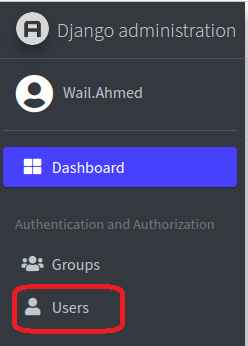

<h1 align="center"> AutoBat Web Application </h1>

<h2 id="table-of-contents"> 📋 Table of Contents</h2>

  
Table of Contents

  <ol>
    <li><a href="#overview"> ➤ Overview</a></li>
    <li><a href="#features"> ➤ Main Features</a></li>
    <li><a href="#technologies-used"> ➤ Technologies Used</a></li>
    <li><a href="#installation"> ➤ Installations</a></li>
    <li><a href="#setup"> ➤ Setting Up the Development Environment</a></li>
    <li><a href="#deployment"> ➤ Deployment</a></li>
    <li><a href="#config"> ➤ Configurations</a></li>
    <li><a href="#getting-started"> ➤ Getting Started</a></li>
    <li><a href="#project-files-description"> ➤ Project Files Description</a></li>
    <li><a href="#functions"> ➤ Important Functions</a></li>
        <ol>
        <li><a href="#function1"> ➤ Function 1: experimentfile </a></li>
        <li><a href="#function2"> ➤ Function 2: run_analysis_autobat </a></li>
        <li><a href="#function3"> ➤ Function 3: run_analysis_autograt </a></li>
        <li><a href="#function4"> ➤ Function 4: re_analysis_all </a></li>
        <li><a href="#function5"> ➤ Function 5: run_analysis_autobat_task </a></li>
        <li><a href="#function6"> ➤ Function 6: run_analysis_autograt_task </a></li>
        <li><a href="#function7"> ➤ Function 7: research_results </a></li>
        </ol>
    <li><a href="#cases"> ➤  Common Use Cases </a></li>
        <ol>
        <li><a href="#case1"> ➤ Case 1: Add New User </a></li>
        <li><a href="#case2"> ➤ Case 2: Delete Experemant Files </a></li>
        <li><a href="#case3"> ➤ Case 3: Add New Analysis Type </a></li>
        <li><a href="#case4"> ➤ Case 4: Update Research Questions Page </a></li>
        <li><a href="#case5"> ➤ Case 5: Change Allergens from Admin Panel </a></li>
        <li><a href="#case6"> ➤ Case 6: Change Allergens for all files in an experiment </a></li>
        <li><a href="#case7"> ➤ Case 7: Change Allergens from the Database </a></li>
        <li><a href="#case8"> ➤ Case 8: Download files from the server </a></li>
        </ol>
    <li><a href="#Troubleshooting"> ➤ Troubleshooting </a></li>
    <li><a href="#To-Do"> ➤ To Do </a></li>
    <li><a href="#references"> ➤ References</a></li>
  </ol>

 
<h2 id="overview"> 📖 Overview</h2>

 
  AutoBatWeb is a web-based application developed to facilitate the storage, analysis, and visualization of the flow cytometry experimental files (fcs file format) using a friendly user interface and populating data into the database. Designed to meet the needs of our research group of having datasets and their analysis results stored in a single database to retrieve and compare results.

 
<h2 id="features"> 🎯 Main Features</h2>
<ul>
  <li><b>User-friendly interface</b></li>
  <li><b>Secure login</b></li>
  <li><b>Upload FCS files</b></li>
  <li><b>Automatically extract and store Metadata and channels</b></li>
  <li><b>Background tasks to run the analysis of FCS files</b></li>
  <li><b>Export results as excel files</b></li>
  <li><b>Export visualization plots as pdf</b></li>
  <li><b>Generate Reports</b></li>

</ul>

 
<h2 id="technologies-used"> 🌐 Technologies Used</h2>
<ul>
  <li><b>Frontend:</b></li>
    <ul>
      <li><b>HTML </b></li>
      <li><b>Bootstrap</b></li>
    </ul>
  <li><b>Backend:</b></li>
    <ul>
      <li><b>Python</b></li>
      <li><b>Django</b></li>
    </ul>
  <li><b>Database:</b></li>
    <ul>
      <li><b>PostgreSQL</b></li>
    </ul>
  <li><b>Web server</b> </li>
    <ul>
      <li><b>Ubuntu 22.04</b></li>
      <li><b>apache2</b></li>
    </ul>
  <li><b>Additional Modules</b> </li>
    <ul>
      <li><b>django-background-tasks</b></li>
      <li><b>django-jazzmin</b></li>
      <li><b>mod_wsgi</b></li>
    </ul>
</ul>

 
<h2 id="installation"> ⚙️ Installations</h2>

 
  The following instructions work for Ubuntu 22.04 (for other operating systems refer to the documentation of each installation). 

<ol>
  <li><b>Install Anaconda:</b></li>
    <ul>
      <li><b>Download Anaconda:<pre><code>url https://repo.anaconda.com/archive/Anaconda3-2021.11-Linux-x86_64.sh --output anaconda.sh</code></pre></b></li>
      <li><b>Install Anaconda:<pre><code>bash anaconda.sh</code></pre></b></li>
      <li><b>Reload bach profile<pre><code>source ~/.bashrc</code></pre></b></li>
    </ul>
  <li><b>Install apache2</b></li>
    <ul>
      <li><b><pre><code>sudo apt update</code></pre></b></li>
      <li><b><pre><code>sudo apt install apache2</code></pre></b></li>
      <li><b><pre><code>sudo apt-get install libapache2-mod-wsgi-py3</code></pre></b></li>
    </ul>
    
  <li><b>Install Git</b></li>
    <ul>
      <li><b><pre><code>sudo apt update</code></pre></b></li>
      <li><b><pre><code>sudo apt install git</code></pre></b></li>
    </ul>
  <li><b>Install PostgreSql</b></li>
    <ul>
      <li><b><pre><code>sudo apt update</code></pre></b></li>
      <li><b><pre><code>sudo apt install postgresql postgresql-contrib</code></pre></b></li>
    </ul>
</ol>

 
<h2 id="setup"> ⚙️ Setting up the environment</h2>

 
   The following instructions work for Ubuntu 22.04 (for other operating systems refer to the documentation of each installation). 

<ol>
  <li><b>Create Database:</b></li>
    <ul>
      <li><b>Access the database:<pre><code>sudo -i -u postgres </code></pre></b></li>
      <li><b><pre><code>psql</code></pre></b></li>
      <li><b>Change the default user password:<pre><code>ALTER USER postgres WITH PASSWORD 'YOR-NEW-PASSWOR';</code></pre></b></li>
      <li><b>Create new user<pre><code>CREATE USER baumgrass WITH PASSWORD 'YOR-NEW-PASSWOR';</code></pre></b></li>
      <li><b>Create a new database<pre><code>CREATE DATABASE autobatdb;</code></pre></b></li>
      <li><b>Make the new user the owner of the database<pre><code>ALTER DATABASE autobatdb OWNER TO baumgrass;</code></pre></b></li>
      <li><b>Exit postgres<pre><code>\q</code></pre></b></li>
    </ul>
  <li><b>Create Conda environment</b></li>
    <ul>
      <li><b><pre><code>conda create --name AutoBat</code></pre></b></li>
    </ul>
  <li><b>Activate Conda environment</b></li>
    <ul>
      <li><b><pre><code>conda activate AutoBat</code></pre></b></li>
    </ul>
  <li><b>Install R</b></li>
    <ul>
      <li><b><pre><code>conda install -c conda-forge r-base=3.6.3</code></pre></b></li>
    </ul>
  <li><b>Install Python</b></li>
    <ul>
      <li><b><pre><code>conda install python=3.8.5</code></pre></b></li>
    </ul>
  <li><b>Install R packages</b></li>
    <ul>
      <li><b><pre><code>R </code></pre></b></li>
      <li><b><pre><code>install.packages("MASS")</code></pre></b></li>
      <li><b><pre><code>install.packages("stringr")</code></pre></b></li>
      <li><b><pre><code>if (!requireNamespace("BiocManager", quietly = TRUE))
    install.packages("BiocManager")</code></pre></b></li>
      <li><b><pre><code>BiocManager::install("flowCore")</code></pre></b></li>
      <li><b><pre><code>install.packages("colorspace")</code></pre></b></li>
      <li><b><pre><code>install.packages("extrafont")</code></pre></b></li>
      <li><b><pre><code>library(extrafont)</code></pre></b></li>
      <li><b><pre><code>font_install("fontcm")</code></pre></b></li>
      <li><b><pre><code>loadfonts()</code></pre></b></li>
      <li><b><pre><code>q()</code></pre></b></li>
    </ul>
</ol>

 
<h2 id="config"> ⚡️ Configurations</h2>

 
  For security reasons, we have stored sensitive information like SECRET_KEY and database credentials in a separate file. Also, we have stored the path to the AutoBatWorkFlow in the file to be easily changed every time you change the path.
  This file is called config.py and it is stored in the Django project directory and ignored by git, so you need to create it as it is not available in the GitHub repository.

<ol>
  <li><b>Create a folder in the home directory:<pre><code>mkdir autoBatWeb</code></pre></b></li>
  <li><b><pre><code>cd autoBatWeb</code></pre></b></li>
  <li><b>Clone Autobat repository<pre><code>git clone https://github.com/InesHo/auto-BAT.git</code></pre></b></li>
  <li><b>Go to the Autobat deirectory<pre><code>cd auto-BAT </code></pre></b></li>
  <li><b>Change the branch<pre><code>git checkout webdev </code></pre></b></li>
  <li><b>Go Back to autoBatWeb directory <pre><code>cd ../ </code></pre></b></li>
  <li><b>Clone Autobat-Web repository<pre><code>git clone  https://github.com/InesHo/auto-BAT-Web.git</code></pre></b></li>
  <li><b>Navigate to the Autobat-Web project directory<pre><code>cd auto-BAT-Web</code></pre></b></li>
  <li><b>Create config file<pre><code>vim config.py</code></pre></b></li>
  <li><b>Add the following variables<pre><code>DATABASE_NAME = 'autobatdb'
USER = 'baumgrass'
PASSWORD = ... Find the password in the server or create your own
HOST = '127.0.0.1' # Change the IP if the database is stored in another server
PORT = '5432'
SECRET_KEY = ... # Find the key in the server or create your own
AUTOBAT_PATH = '/home/abusr/autoBatWeb/auto-BAT'
</code></pre></b></li>
  <li><b>Install dependencies<pre><code>pip install -r requirements.txt</code></pre></b></li>
  <li><b>Change anaconda path in Plotting.py</b></li>
  <ol>
    <li><b>Go to the auto-BAT directory </b></li>
    <li><b>Open  Plotting.py<pre><code>vim autoBat/Plotting.py</code></pre></b></li>
    <li><b>At the beginning of the file change the paths to your conda environment as you see in the following example:<pre><code>
    conda_prefix = '/home/abusr/anaconda3/envs/AutoBat'
    r_prefix = '/home/abusr/anaconda3/envs/AutoBat/lib/R'
    r_path = '/home/abusr/anaconda3/envs/AutoBat/lib/R/bin/x64'</code></pre></b></li>
    <li><b>Change the encoding path to the encoding library used by R in the conda environment. To do it search for the following line and change it everywhere<pre><code>encoding="/home/abusr/anaconda3/envs/AutoBat/lib/R/library/grDevices/enc/ISOLatin1.enc"</code></pre></b></li>
  </ol>
  <li><b>Make migrations<pre><code>python manage.py makemigrations</code></pre></b></li>
  <li><b>Migrate<pre><code>python manage.py migrate</code></pre></b></li>
  <li><b>Create Superuser to login<pre><code>python manage.py createsuperuser</code></pre></b></li>
  <li><b>Run the application<pre><code>python manage.py runserver</code></pre></b></li>
</ol>

 
<h2 id="deployment"> 🖥️ Deployment</h2>

 
 In the previous step, the application will be running in the Django default port and will not be continuously running as it is considered a development mode, so we have used Apatche2 and mod_wsgi to deploy the application.

<ol>

  <li><b>In the settings.py change ALLOWED_HOSTS if you want to deploy in another server</b></li>
  <li><b>Open Apache2 web configuration file<pre><code>cd /etc/apache2/sites-available/</code></pre></b></li>
  <li><b>Create a new file for autobat config by copying the default config<pre><code>sudo cp 000-default.conf autobat_web.conf</code></pre></b></li>
  <li><b>Edit the file<pre><code>sudo vim autobat-web.conf</code></pre></b></li>
  <li><b>Add the following to the end of the file - (make sure to change paths)
  <pre><code>

        LoadModule wsgi_module modules/mod_wsgi.so
        Alias /static /home/abusr/autoBatWeb/auto-BAT-Web/static
        <Directory /home/abusr/autoBatWeb/auto-BAT-Web/static>
                Require all granted
        </Directory>

        Alias /media /home/abusr/autoBatWeb/auto-BAT-Web/media
        <Directory /home/abusr/autoBatWeb/auto-BAT-Web/media>
                Require all granted
        </Directory>

        <Directory /home/abusr/autoBatWeb/auto-BAT-Web/autoBatWeb>
                <Files wsgi.py>
                        Require all granted
                </Files>
        </Directory>

        WSGIScriptAlias / /home/abusr/autoBatWeb/auto-BAT-Web/autoBatWeb/wsgi.py
  </pre></code></b></li>
  <li><b>Collect static files for production (from Django project directory)<pre><code>python manage.py collectstatic</code></pre></b></li>
  <li><b>Run the command in project directory (autoBatWeb)<pre><code>python auto-BAT-Web/manage.py runmodwsgi --setup-only --port=80 --user abusr  --access-log --server-name=autobat.drfz.de --server-root=AutoBat-Webserver-80</code></pre>This will create a new folder that stores the website settings </b></li>
  <li><b>Create a file for starting the app<pre><code>sudo vim /usr/bin/start_autobat </code></pre></b></li>
  <li><b>Add the following (considering path)<pre><code>sudo /home/abusr/autoBatWeb/AutoBat-Webserver-80/apachectl start </code></pre></b></li>
  <li><b>Create file for stopping the app<pre><code>sudo vim /usr/bin/stop_autobat</code></pre></b></li>
  <li><b>add the following (considering path)<pre><code>sudo /home/abusr/autoBatWeb/AutoBat-Webserver-80/apachectl stop</code></pre></b></li>
  <li><b>Create file to restarting the app<pre><code>sudo vim /usr/bin/restart_autobat</code></pre></b></li>
  <li><b>Add the following (considering path)<pre><code>sudo /home/abusr/autoBatWeb/AutoBat-Webserver-80/apachectl restart</code></pre></b></li>
</ol>

 
<h2 id="getting-started"> 🏁 Getting Started</h2>

 
 In the previous step, we have created executable scripts so we can simply start and stop the app using the following commands:

<ul>
  <li><b>start the web-app<pre><code>start_autobat </code></pre></b></li>
  <li><b>stop the web-app<pre><code>stop_autobat </code></pre></b></li>
  <li><b>restart the web-app<pre><code>restart_autobat </code></pre></b></li>

</ul>

 
 The background tasks should be started separately and can only be run in the Django project directory and the conda environment should be activated.

<ul>
  <li><b>Start background tasks<pre><code>nohup python manage.py process_tasks > tasks.log & </code></pre></b></li>
  <li><b>See if the background task is running <pre><code>ps aux | grep manage.py </code></pre></b></li>
  
  <li><b>Stop background tasks (the pid is highlighted in the previous image)<pre><code>kill [pid] </code></pre></b></li>
</ul>

 
<h2 id="project-files-description"> 📂 Project Files Description</h2>
<ul>
  <li><b>functions.py: </b> Contains the functions we have created to support some functionalities like changing the metadata of FCS files and creating the pdf files for the plots</li>
  <li><b>models.py: </b> Contains the tables used for storing data and defining their relations</li>
  <li><b>tasks.py: </b>Contains the functions that should run in the background like collecting metadata, channels data, marker means and run AutoBat and AutoGrat analysis</li>
  <li><b>views.py: </b>Contains data to be rendered on HTML templates</li>
</ul>

 
<h2 id="functions"> 📜 Important Functions</h2>
<h3 id="function1"> 🔸 Function 1: experimentfile</h3>

 
 This is a view class that is used to upload and process FCS files. Following are the points to the way it works:

<ul>
  <li><b> GET Method: </b></li>
  <ul>
    <li><b> Renders a form (ExperimentFilesForm) to upload experiment files</b></li>
    <li><b> Renders the 'files/add_files.html' template with the form </b></li>
  </ul>
    <li><b> POST Method: </b></li>
  <ul>
    <li><b>Handles the form submission</b></li>
    <li><b>Retrieves files from the request</b></li>
    <li><b>Validates the form data</b></li>
    <li><b>Extracts form data such as bat ID, donor ID, panel ID, and condition</b></li>
    <li><b>Creates a new analysis instance with the extracted data</b></li>
    <li><b>Saves the analysis ID for future reference</b></li>
    <li><b>Creates directories for storing uploaded files based on bat ID, donor ID, panel ID, and condition</b></li>
    <li><b> Iterates over each uploaded file:</b></li>
      <ul>
      <li><b>Saves the file to the appropriate directory</b></li>
      <li><b>Retrieves metadata from the uploaded file</b></li>
      <li><b>Extracts allergen information from the metadata</b></li>
      <li><b>Creates an instance of ExperimentFiles for each uploaded file, storing file details, allergen information, and control type</b></li>
      <li><b>Saves the file instance with the associated analysis ID and user ID</b></li>
      <li><b>Processes the uploaded files using the change_FCS_data function and runs it as a background tasks</b></li>
      </ul>
    <li><b>Extracts channel information from one of the uploaded files</b></li>
    <li><b>Creates instances of Channels for each channel in the uploaded files, storing channel pnn and pns</b></li>
    <li><b>Initiates the processing of uploaded files using the process_files function and runs it as a background tasks</b></li>
    <li><b>Renders the 'files/files_ready.html' template with the analysis ID when successful file processing</b></li>
    <li><b>Renders the 'files/files_error.html' template if there was an error</b></li>
  </ul>
</ul>

 
<h3 id="function2"> 🔸 Function 2: run_analysis_autobat</h3>

 

 This is a view function that is used to collect the required parameters and sends them to the background tasks to analyze AutoBat. Following are the points to the way it works:

<ul>
  <li><b> POST request: </b></li>
  <ul> 
  <li><b>Retrieves necessary data from the request and the database (e.g., bat ID, donor ID, panel ID)</b></li>
  <li><b>Parses parameters from the request related to manual thresholds and chosen markers</b></li>
  <li><b>Checks if the analysis for the chosen markers has already been performed</b></li>
  <li><b>If not, create an instance of AnalysisMarkers in the database to track the analysis</b></li>
  <li><b>Determines file paths for data, exports, and output based on the conditions</b></li>
  <li><b>Executes the run_analysis_autobat_task function with the provided parameters</b></li>
  <li><b>Renders the "analysis/analysis_ready.html" template upon successful execution</b></li>
  </ul>
<li><b> If Error: </b></li>
  <ul>
    <li><b>Renders the "analysis/analysis_error.html" template if the analysis for the chosen markers has already been performed</b></li>
    <li><b>Renders the "analysis/analysis_markers_error.html" template if no markers have been selected for analysis</b></li>
  </ul>
</ul>

 
<h3 id="function3"> 🔸 Function 3: run_analysis_autograt</h3>

 
 This is a view function that is used to collect the required parameters and sends them to the background tasks to analyze AutoGrat. Following are the points to the way it runs:
 

<ul>
  <li><b> POST request: </b></li>
  <ul> 
    <li><b> Retrieves necessary data from the request and the database (e.g., bat ID, donor ID, panel ID) </b></li>
    <li><b> Parses parameters from the request related to chosen markers (X, Y, Z2_1 to Z2_4) </b></li>
    <li><b> Prepares data for the analysis, including labels and conditions</b></li>
    <li><b> Checks if the selected markers for analysis have already been used</b></li>
    <li><b> If not, create an instance of AnalysisMarkers in the database to track the analysis</b></li>
    <li><b> Determines file paths for data, exports, and output based on the conditions</b></li>
    <li><b> Executes the run_analysis_autograt_task function with the provided parameters</b></li>
    <li><b> Renders the "analysis/analysis_ready.html" template upon successful execution</b></li>
  </ul> 
  <li><b>If Error: </b></li>
    <ul> 
    <li><b>Renders the "analysis/analysis_error.html" template if the analysis for the chosen markers has already been performed</b></li>
    <li><b>Renders the "analysis/analysis_markers_error.html" template if no markers have been selected for analysis</b></li>
    </ul> 
  </ul> 

 
<h3 id="function4"> 🔸 Function 4: re_analysis_all</h3>

 
 This is a view function that is used to delete old analyses of the latest version and reanalyze them or analyze them with a new version by collecting required parameters and sending them to the background tasks to analyze AutoBat or AutoGrat. Following are the points to the way it runs:

<ul>
<li><b>Parses the analysis type from the request</b></li>
<li><b>If the analysis type is "AutoBat":</b></li>
  <ul>
  <li><b>Retrieves analysis markers data for AutoBat analysis from the database</b></li>
  <li><b>Iterates over each analysis marker and gathers necessary data for re-analysis</b></li>
  <li><b>Determines file paths for data, exports, and output based on conditions</b></li>
  <li><b>Checks the current version against the stored version</b></li>
  <li><b>If versions match:</b></li>
    <ul>
    <li><b>Deletes existing analysis data associated with the marker</b></li>
    <li><b>Updates analysis status to "Waiting" and clears any error or info messages</b></li>
    <li><b>Executes the run_analysis_autobat_task function with the provided parameters</b></li>
    </ul>
  <li><b>If versions don't match:</b></li>
    <ul>
    <li><b>Creates a new instance of analysis markers for re-analysis</b></li>
    <li><b>Executes the run_analysis_autobat_task function with the provided parameters</b></li>
    </ul>
  </ul>
<li><b>If the analysis type is "AutoGrat", the process is similar to "AutoBat" with adjustments for the analysis type:</b></li>
  <ul>
  <li><b>Retrieves analysis markers data for AutoGrat analysis from the database</b></li>
  <li><b>Iterates over each analysis marker and gathers necessary data for re-analysis</b></li>
  <li><b>Determines file paths for data, exports, and output based on conditions</b></li>
  <li><b>Checks the current version against the stored version</b></li>
    <li><b>If versions match:</b></li>
    <ul>
    <li><b>Deletes existing analysis data associated with the marker</b></li>
    <li><b>Updates analysis status to "Waiting" and clears any error or info messages</b></li>
    <li><b>Executes the run_analysis_autograt_task function with the provided parameters</b></li>
    </ul>
  <li><b>If versions don't match:</b></li>
    <ul>
    <li><b>Creates a new instance of analysis markers for re-analysis</b></li>
    <li><b>Executes the run_analysis_autograt_task function with the provided parameters</b></li>
    </ul>
  </ul>
<li><b>>Renders the "analysis/re_analysis_error.html" template if the analysis type is neither "AutoBat" nor "AutoGrat":</b></li>
<li><b>When successful re-analysis, it renders the "analysis/analysis_ready.html" template</b></li>
</ul>
  
 
<h3 id="function5"> 🔸 Function 5: run_analysis_autobat_task</h3>

 This is a task function that is used to recive parameters from the view function and send them to the AutoWorkFlow to analyze AutoBat in the background and then saves the results to the databas. Following are the points to the way it works:

<ul>
  <li><b>Sets start time for analysis and updates status to "In Progress"</b></li>
  <li><b>Retrieves information about experiment files related to the analysis</b></li>
  <li><b>Processes each sample file:</b></li>
  <ul>
    <li><b>If the panel is either "bat-panel" or "reduced-panel", performs gating using BaumgrassGating</b></li>
    <li><b>Otherwise, constructs a report with basic information due to no automatic pregating for the panel</b></li>
  </ul>
  <li><b>Executes an automated workflow (AutoBatWorkflow) to generate results.</b></li>
  <li><b>Processes the results and updates report information such as thresholds, percentages, and quality messages.</b></li>
  <li><b>Generates a final report.</b></li>
  <li><b>Saves the final report to an Excel file and stores it in the database.</b></li>
  <li><b>Saves analysis thresholds and results to the database.</b></li>
  <li><b>Saves quality messages and plots to the database.</b></li>
  <li><b>If there is an error: saves the analysis status as Error and stores the analysis error in the database</b></li>
</ul>

 
<h3 id="function6"> 🔸 Function 6: run_analysis_autograt_task</h3>

 This is a task function that is used to recive parameters from the view function and send them to the AutoWorkFlow to analyze AutoGrat in the background and then saves the results to the database. Following are the points to the way it works:

<ul>
  <li><b>Updates the start time of the analysis and sets the status to "In Progress".</b></li>
  <li><b>Retrieves information about the files related to the analysis.</b></li>
  <li><b>Processes each sample file:</b></li>
  <ul>
    <li><b>If the panel is either "bat-panel" or "reduced-panel", performs gating using BaumgrassGating</b></li>
    <li><b>Otherwise, constructs a report with basic information due to no automatic pregating for the panel</b></li>
  </ul>
  <li><b>If there are multiple z-markers, creates separate reports for each combination of files and markers.</b></li>
  <li><b>Executes an automated workflow (AutoBatWorkflow) to generate results.</b></li>
  <li><b>Processes the results and updates report information such as thresholds, percentages, and quality messages.</b></li>
  <li><b>Generates a final report.</b></li>
  <li><b>Saves the final report to an Excel file and stores it in the database.</b></li>
  <li><b>Saves analysis thresholds and results to the database.</b></li>
  <li><b>Saves quality messages and plots to the database.</b></li>
  <li><b>If there is an error: saves the analysis status as Error and stores the analysis error in the database</b></li>
</ul>

 
<h3 id="function7"> 🔸 Function 7: research_results</h3>

 
 This is a view function that is used to retrive and filter data from the database based on the filters in the research questions interface. Following are the points to the way it works:

<ul>
  <li><b>Extracts data from the AnalysisResults model and related models</b></li>
  <li><b>Allows filtering of the extracted data based on various parameters from the request</b></li>
  <li><b>Generates an Excel file containing the filtered data</b></li>
  <li><b>Saves the Excel file in a specified directory to be downloaded from the research results page</b></li>
  <li><b>Saves a CSV file containing the IDs of associated files if the number of rows in the data is less than 500 to be used to retrive plots to download a pdf</b></li>
  <li><b>Renders a template (analysis/research_results.html) with the filtered analysis results, Excel file name, CSV file name (if less than 500 records), and the count of rows in the data</b></li>
</ul>

 
<h2 id="cases"> 👀 Examples of Common cases </h2>
<h3 id="case1"> 🔸 Case 1: Add New User</h3>
<ol>
  <li><b> Go to the Admin Panel </b></li>
  
  <li><b> In the Authentication and Authorization click Users </b></li>
  
  <li><b> Click Add user </b></li>
  
  <li><b> Write the username and password and click save </b></li>
  
</ol>

 

<h3 id="case2"> 🔸 Case 2: Delete Experemant Files </h3>

 
  Make sure to follow the steps carefully, and delete the physical files exactly as we show in the following steps:

<ol>
  <li><b> Go to the Analysis page </b></li>
  
  <li><b> Show the files of the experiment you want to delete </b></li>
  
  <li><b> Memorize the analysis number at the end of the url </b></li>
  
  <li><b> Go to the Admin Panel </b></li>
  
  <li><b> Click on the Analysis model </b></li>
  
  <li><b> Click on the analysis number you memorized in step 3 </b></li>
  
  <li><b> Click delete </b></li>
  
  <li><b> Go to the files directory in the operating system - for the mentioned example the directory is: <pre><code>cd media/FCS_files/BAT_207/DZWN1/platelet-panel/standard_BAT </code></pre></li>
  <li><b> List the files to do final check<pre><code>ls </code></pre></li>
  
  <li><b> Delete the files inside the folder <pre><code>rm *.fcs </code></pre></li>
</ol>
 

<h3 id="case3"> 🔸 Case 3: Add New Analysis Type </h3>

 
  This covers how to find a function you need to implement or change in general, by creating a new analysis type as an example:

<ol>
  <li><b>Find the name of the function from the URL. (the function from the following URL is analysis_type)<pre><code>http://autobat.drfz.de/add_experimentfile/update_files/add_channels/analysis_type/419</code></pre></b></li>
  <li><b>Find the function in the views.py</b></li>
  <li><b>Add any parameters you need or retrieve from the database</b></li>
  <li><b>Find the path to the HTML file rendered by this function</b></li>
  <li><b>Open the HTML file, add a button and make its URL go to the new function. (for example) <pre><code>marker_settings_NEWTYPE/{{analysis_id}}</code></pre> </b></li>
  <li><b>Make sure to add the new URL in the urls.py for every new function</b></li>
  <li><b>In the views, create new marker_settings_NEWTYPE and render to an HTM file analysis/marker_settings_NEWTYPE.html (similar to the current function: marker_settings_autobat) </b></li>
  <li><b>Create an HTML file called marker_settings_NEWTYPE.html in the analysis folder and let the form submit the request to run_analysis_NEWTYPE. (similar to the current page: marker_settings_autobat.html)</b></li>
  <li><b>In the views create a new function run_analysis_NEWTYPE (similar to the current function: run_analysis_autobat)</b></li>
  <li><b>In the tasks create a new function run_analysis_NEWTYPE_tasks (similar to the current function run_analysis_autobat_tasks)</b></li>
</ol>
 
<h3 id="case4"> 🔸 Case 4: Update Research Questions Page</h3>
<ol>
  <li><b>Customize the HTML file analysis/research_questions.html</b></li>
  <li><b>If you have added any element you should add it to the auto-BAT-Web/static/js/filters.js in the function resetFilters().</b></li>
  <li><b>If you have a list follow the following:</b></li>
  <ol>
    <li><b>Create a view function to retrieve the list (similar to the current function getBat_names)</b></li>
    <li><b>Create a javascript function to show the data in the list (similar to the current function getBat_names() in the filters.js)</b></li>
    <li><b>Load the javascript at the beginning of the file filters.js</b></li>
  </ol>
  <li><b>To change the results customize the function "research_results" in the views.py</b></li>
</ol>
 
<h3 id="case5"> 🔸 Case 5: Change Allergens from Admin Panel </h3>

 
  This covers how to change any record in the database using the Admin panel by  updating allergen as an example:

<ol>
  <li><b>Find the ID of the record from the URL. (the file_id from the following URL is 5973)<pre><code>http://autobat.drfz.de/show_experimentfile/show_rawdata/5973</code></pre></b></li>
  <li><b>Go to the Admin panel and open the model Experiment filess</b></li>
  <li><b>Find the file data by using the file id </b></li>
  <li><b>Update the allergen field and click save</b></li>
</ol>
 
<h3 id="case6"> 🔸 Case 6: Change Allergens for all files in an experiment </h3>
<ol>
  <li><b> Go to the Analysis page </b></li>
  <li><b> Find the experiment</b></li>
  <li><b> Click analyze </b></li>
  <li><b> Go to the URL and remove add_channels/analysis_type from the URL. The URL shoild then look like this:<pre><code>http://autobat.drfz.de/add_experimentfile/update_files/419</code></pre> </b></li>
  <li><b> You will see a list of all files and thier data </b></li>
  <li><b> Change data and click update </b></li>
</ol>
 

<h3 id="case7"> 🔸 Case 7: Change Allergens from the Database </h3>

 
 This covers how to access the database and update any record by updating allergen as an example:

<ol>
  <li><b>Access the database <pre><code>sudo -i -u postgres</code></pre>
  <pre><code>psql</code></pre></b></li>
  <li><b>List databases <pre><code>\l</code></pre></b></li>
  <li><b>Connect to autobatdb <pre><code>\c autobatdb</code></pre></b></li>
  <li><b>list tables <pre><code>\dt</code></pre></b></li>
  <li><b>Select query<pre><code>SELECT file_name, allergen from "populateDB_experimentfiles" WHERE allergen = '-IL3';</code></pre></b></li>
  <li><b>Update query<pre><code>UPDATE "populateDB_experimentfiles" SET allergen = 'us' WHERE file_id = [ANYNUMBER];</code></pre></b></li>
</ol>
 

<h3 id="case8"> 🔸 Case 8: Download files from the server </h3>
<ol>
  <li><b>Find where the file you want is stored in the server <pre><code>For example:
  my file is: 11BAT157_JG_extr-test-glutKS-HCl-5.2d-50ug.fcs
  stored in: home/abusr/autoBatWeb/auto-BAT-Web/media/FCS_fiels/BAT_157/JG/grat-panel</code></pre></b></li>
  <li><b>Open cmd from the location you want to save the file in your computer and type: 
  <pre><code>scp abusr@10.100.4.95:/home/abusr/autoBatWeb/auto-BAT-Web/media/FCS_fiels/BAT_157/DZWN1/grat-panel/11BAT157_JG_extr-test-glutKS-HCl-5.2d-50ug.fcs .</code></pre>
  The . at the end specifies the current path and can also be replaced by any other path you want the files to be downloaded to</b></li>
  <li><b>Write the server's password and the file will be downloaded</b></li>
</ol>

<h2 id="Troubleshooting"> ⚠️ Troubleshooting</h2>
<ul>
  <li><b>Sometimes after restarting the operating system in the server the web application cant run: This is because the apache might be using the default port so we need to stop it and restart the app again</b><pre><code>sudo /etc/init.d/apache2 stop </code></pre><pre><code>start_autobat</code></pre></li>

  <li><b>AutoBatWorkFlow updates are not applied?</b> Make sure to cover the following steps:</li>
  <ul>
    <li>Pull auto-Bat updates from GitHub (webdev branch)</li>
    <li>If the new update requires another parameters, make sure to include them in the view functions: run_analysis_autobat, run_analysis_autograt and reanalyze_all and the tasks function: run_analysis_autobat_tasks and run_analysis_autograt_tasks</li>
    <li>If the results have been chabged by adding new columns, then add the required column in the modal Analysis_results in the models.py file</li>
    <li>Restart the web app (see <a href="#getting-started"> Getting Started</a>)</li>
    <li>Restart Background tasks (see <a href="#getting-started"> Getting Started</a>)</li>
  </ul>
  <li>Upload files failed: make sure file names and allergen do not contain unknown characters</li>
</ul>

 
<h2 id="To-Do"> 💡 To-Do</h2>
<ul>
  <li><b>The Django project is created with only one app (populateDB), so it is recommended to divide it into multiple apps</b></li>
  <li><b>Add interfaces to allow users to delete and update records</b></li>
  <li><b>Inhance retrieving data from the database. For example using select_related to reduce the number of queries sent to the database and make it much faster</b></li>
</ul>

 
<h2 id="references"> 📚 References</h2>
<ul>
  <li><a href="https://docs.djangoproject.com/en/3.2/"> Django Documentation </a></li>
  <li><a href="https://docs.djangoproject.com/en/3.2/howto/deployment/wsgi/modwsgi/"> Django modwsgi </a></li>
  <li><a href="https://www.postgresql.org/docs/current/tutorial-start.html"> postgresql Documentation </a></li>
  <li><a href="https://getbootstrap.com/docs/5.0/getting-started/introduction/"> Bootstrap Documentation </a></li>
</ul>
